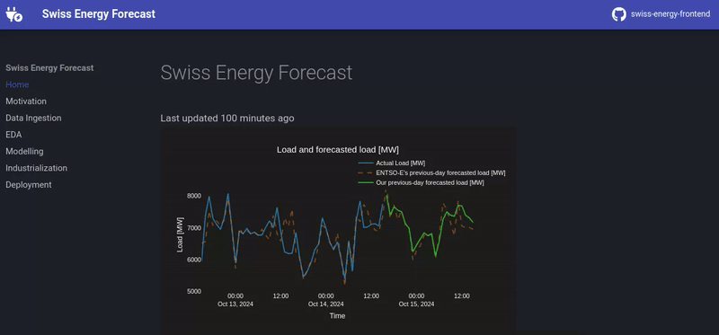
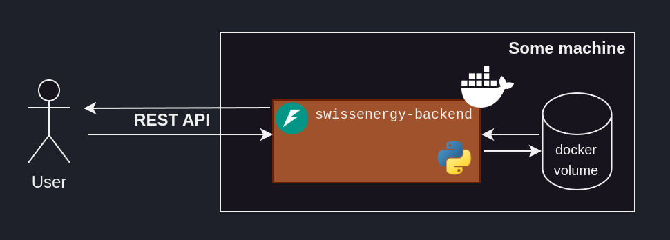

# swissenergy-backend

<br>

<p align="center">🚀 <a href="https://swissenergy.arthurgassner.ch"><strong>live dashboard & detailed write-up</strong></a> 🚀</p>

<br>

<p align="center"><p>

This repository contains the ML backend powering an **energy consumption prediction dashboard**.

Inspired by the [SFOE's energy consumption dashboard](https://www.energiedashboard.admin.ch/strom/stromverbrauch), I figured it would be a great opportunity to talk about an end-to-end ML project, going over the challenges one encounters during

- Problem Understanding
- Data Ingestion
- Exploratory Data Analysis
- Machine Learning Modelling
- Industrialization
- Deployment

> [!IMPORTANT]
> I _heavily_ encourage you to check out the 🚀 [**write-up**](https://swissenergy.arthurgassner.ch) 🚀 to make sense of this repo, as it goes through each stage methodically.

> [!NOTE]  
> The code for the frontend can be found [here](https://github.com/arthurgassner/swissenergy-frontend).

## Repo structure

The repo is structured as follows

```bash 
├── app/ # ML backend
├── img/ 
├── viz/ # Visualization built for the writeup
├── nb-dev/ # Notebooks created during the EDA/Modelling phase
├── tests/ # pytests
├── .pyproject.toml
├── .gitignore 
├── .pre-commit-config.yaml 
├── Dockerfile
├── README.md
├── data_checks.ipynb # Used to manually check our data
├── compose.yml 
└── sanity_checks.ipynb # Used to manually check our some inputs
```

## Running the backend

The backend is meant to be run as a dockerized app, running off some machine. This project's [write-up](https://swissenergy.arthurgassner.ch) goes in depth about how to run the backend.


