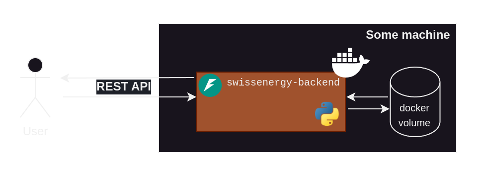

# `swissenergy-backend`

This repository contains the ML backend powering a energy consumption prediction.

Inspired by the [SFOE's energy consumption dashboard](https://www.energiedashboard.admin.ch/strom/stromverbrauch), I figured it would be a great opportunity to showcase an end-to-end ML project, going over the challenges one encounters during

- Problem Understanding
- Data Ingestion
- Exploratory Data Analysis
- Machine Learning Modelling
- Industrialization
- Deployment


A **dashboard and complete write-up** of each stage can be found 🚀 [here](swissenergy.arthurgassner.ch) 🚀. <br>

> I _heavily_ encourage you to check out the writeup to make sense of this repo, as it goes through each stage methodically.

## Repo structure

The repo is structured as follows

```bash 
├── data_checks.ipynb # Used to manually check our data
├── docker-compose.yml 
├── Dockerfile
├── img 
├── model_server # ML backend
├── nb-dev # Notebooks created during the EDA/Modelling phase
├── README.md
├── requirements.txt
├── sanity_checks.ipynb # Used to manually check our some inputs
├── tests # pytests
└── viz # Visualization built for the writeup
```

## Running the backend

The backend is meant to be run as a dockerized app, running off some machine. This [project's writeup](swissenergy.arthurgassner.ch) goes in depth about how to run this project.


